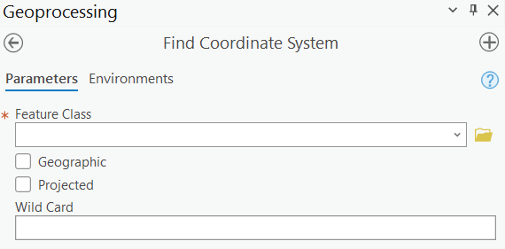

# Find Coordinate System

* Custom geoprocessing Tool for ArcGIS Pro, to help find correct coordinate system for a vector feature layer
* Tries different coordinate systems for a vector feature layer using Define Projection
* Output layers are added to active map and saved into a file geodatabase

